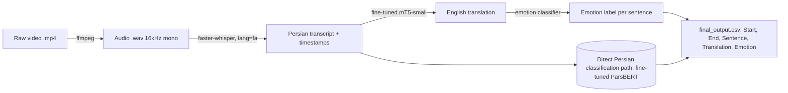

# Persian Emotion Classification from Spoken TV Dialogue

An end-to-end NLP pipeline that detects emotion in spoken Persian-language television dialogue — from raw video to transcribed, translated, emotion-tagged text. Built for a real industry client (the **Content Intelligence Agency**, a media-content-analysis company) during Block A *"AI Scientist – Natural Language Processing"* at Breda University of Applied Sciences (BUas).

> Original team repo: `BredaUniversityADSAI/fae2-nlpr-group-group-15-1` (BUas student org, private). This repository is my personal portfolio copy, reorganized and documented to showcase the project.

## Overview

The client analyses film, TV and video content with AI and wanted a pipeline that could take a raw video, transcribe the speech, translate it to English, and tag the emotion expressed in every sentence. Our group built that pipeline for **Persian (Farsi)**, using two real Iranian TV shows — *Ham Refigh (همرفیق)* and *Metri Shish-o-Nim (متری شیش‌ونیم)* — as our working dataset, and benchmarked traditional ML, deep learning, and transformer approaches against each other for the emotion-classification core of the system.

**My role:** I led the deep-learning / transformer modeling track — fine-tuning ParsBERT through multiple iterations to reach the team's best-performing model, and ran the Conv1D/LSTM and RNN baselines that informed that decision. I also contributed to the data quality analysis and error analysis on the final model.

**Team:** Nika Soleimanzadeh, Asma Moghimi, MohammadAli Jaberi — Group 15, BUas Applied Data Science & AI, Year 2, Block A (Sep–Oct 2025).

## Pipeline Architecture



We explored emotion classification on two text streams: directly on the original Persian sentence (our fine-tuned **ParsBERT** model — the one we put through full error analysis, explainability, and a model card) and on the English translation (using an off-the-shelf Hugging Face classifier inside the integrated `pipeline.py` script). The Persian-native ParsBERT route is the one we evaluated and recommended, since monolingual models consistently outperformed multilingual ones on this low-resource language.

## Key Results

**Speech-to-text (Task 2/3) — Word Error Rate**

| Model | WER | Verdict |
|---|---|---|
| **Whisper (faster-whisper, medium)** | **45.2%** | Chosen for the pipeline |
| AssemblyAI | 72.8% | Dropped — far higher error rate on Persian conversational audio |

For reference, OpenAI's own reported Persian WER for Whisper-medium is ~41%, so our 45.2% on noisy, informal TV dialogue is in a believable range.

**Emotion classification — model iteration leaderboard (Task 6)**

| # | Model | Test Accuracy | F1 | Notes |
|---|---|---|---|---|
| **Final** | **ParsBERT (fine-tuned, best iteration)** | **56.65%** (1,151 samples) | **0.551** (macro) | Official model — full error analysis + model card |
| 7–11 | XLM-RoBERTa-large (5 iterations) | up to ~60% (train/test gap, unstable) | up to ~0.54 | Multilingual model — less consistent on Persian |
| 1–5 | ParsBERT v1, Conv1D, Conv1D+POS (early iterations) | 24–43% | 0.26–0.36 | Early baselines, superseded by final ParsBERT |
| 6 | SimpleRNN + Word2Vec | 17% (test) | 0.16 | Overfit heavily, ruled out |
| 12–14 | Logistic Regression | ~50–53% | 0.51–0.56 | Simple, surprisingly competitive baseline |

7 emotion classes: happiness, sadness, anger, surprise, fear, disgust, neutral.

**Final model performance breakdown**

| Emotion | F1 | Behaviour |
|---|---|---|
| Anger | 0.613 (best) | Reliably recognized |
| Sadness | high | Reliably recognized |
| Happiness | moderate, low recall | Often confused with neutral (subtle positive tone) |
| Surprise / Fear | poor | Underrepresented in data, context-dependent |
| Disgust | 0.000 | Almost no training signal — model never predicts it |
| Neutral | most-confused class | Acts as a "dump class" for ambiguous sentences |

Top confusion pairs: Neutral→Anger (51×), Happiness→Neutral (47×), Sadness→Anger (39×), Neutral→Sadness (37×).

**Prompt engineering — LLM-based alternative (Task 8)**

| Prompt strategy | Accuracy | Macro F1 |
|---|---|---|
| **Few-shot (best)** | 0.837 | **0.690** |
| Baseline (zero-shot) | **0.851** | 0.635 |
| Hybrid (definitions + examples) | 0.696 | 0.553 |
| Ensemble (majority voting) | 0.690 | 0.536 |
| Definition-based | 0.802 | 0.621 |
| Structured JSON output | 0.552 | 0.406 |

Few-shot prompting beat fine-tuned ParsBERT on this metric — a useful finding on the trade-off between fine-tuning and prompting for low-resource languages.

## Dataset

- **Domain/evaluation set:** ~3,650 manually-relevant transcribed lines from 2 Persian TV shows, average sentence length 4.3 words, vocabulary of ~4,362 tokens. ~21.5% of raw lines contained transcription artifacts that needed cleaning.
- **Emotion distribution (domain set):** neutral 46%, happiness 15%, sadness 15%, anger 11%, fear 6%, surprise 5%, disgust 1.5% — heavily imbalanced, which explains the model's weak spots on disgust/surprise/fear.
- **Training data (for ParsBERT):** Persian Twitter/X data (incl. the public EmoPars dataset), video transcripts, and synthetic sentences added to balance underrepresented classes.
- **Beyond the 6 core emotions:** the dataset also carries 318 fine-grained emotion labels (curiosity, resignation, anticipation, etc., mapped back to the 6 Ekman core emotions) and a 5-level intensity scale (mild → overwhelming) — annotation depth that goes beyond the block's minimum requirement and sets up future work on fine-grained or intensity-aware classification.

## Methodology

1. **Annotation** — manually labeled ~4,000 lines of TV dialogue with the 6 core Ekman emotions (+ neutral), peer-reviewed against another student's annotations and the client's existing LLM-based pipeline output.
2. **Speech-to-text** — compared Whisper vs. AssemblyAI on Persian audio via manual WER scoring; selected Whisper (45.2% WER vs 72.8%).
3. **NLP feature extraction** — POS tagging, TF-IDF, sentiment analysis (ParsBERT-based sentiment model), pretrained + custom Persian word embeddings, sentence length and negation features.
4. **Data quality report** — quantified class imbalance, transcription artifacts, and inconsistent fine→core emotion mappings; used to justify the training-data augmentation strategy.
5. **Model iterations** — benchmarked Logistic Regression, Conv1D/LSTM, SimpleRNN, XLM-RoBERTa, and ParsBERT, iterating on preprocessing, class balancing, and hyperparameters; selected fine-tuned ParsBERT as the final model.
6. **Machine translation** — fine-tuned an mT5-small model for Persian→English translation; scored 150 round-trip translations for quality (3 = correct, 2 = minor error, 1 = incorrect).
7. **Prompt engineering** — benchmarked 6 prompting strategies for zero/few-shot emotion classification with an LLM as an alternative to fine-tuning.
8. **Error analysis** — confusion matrix, per-class metrics, n-gram and sentence-length error patterns on the final ParsBERT model.
9. **Explainable AI** — applied Gradient×Input, Layer-wise Relevance Propagation (Conservative Propagation), and input-perturbation analysis to 18 sentences (3 per emotion) to interpret ParsBERT's predictions.
10. **Model card** — documented architecture, intended use, dataset, performance, explainability, and sustainability footprint, following Mitchell et al. (2019).
11. **Full pipeline integration** — chained audio extraction (ffmpeg) → ASR (faster-whisper) → translation (mT5) → emotion classification into one script producing the client's required CSV output.

## Translation Quality Findings

Round-trip scoring of 150 Persian→English translations from the fine-tuned mT5-small model found it grammatically solid but semantically shallow: strong on short, factual, neutral sentences, weaker on idioms (literal translation), polysemous words, and flexible Persian word order. Most errors were semantic drift and occasional hallucinated phrases on longer or ambiguous sentences — consistent with the limited capacity of a "small" multilingual model on a linguistically distant, low-resource language.

## Explainability (XAI)

Compared three explanation methods on the final ParsBERT model:

- **Gradient × Input** — fast, but noisy (assigns relevance to clearly neutral words).
- **Layer-wise Relevance Propagation (Conservative Propagation)** — clearest, most human-aligned explanations; reliably highlighted the actual emotion-bearing words.
- **Input perturbation** — showed that confidence drops sharply when key emotional tokens are removed for some sentences, and gradually for others — i.e. the model sometimes relies on a few tokens, sometimes spreads "attention" across the sentence.

## Sustainability

Fine-tuning was done on an NVIDIA L40S GPU for ~1 hour (~0.35 kWh, ~0.14 kg CO₂e at EU average grid intensity) — kept low by fine-tuning a pretrained model rather than training from scratch.

## Limitations

- Disgust is essentially unrecognized by the final model (F1 = 0.000) due to severe class underrepresentation (1.5% of data).
- Neutral acts as a catch-all for ambiguous input, inflating confusion with every other class.
- The mT5-small translation model lacks the capacity for idiomatic/figurative Persian.
- Evaluation domain (2 specific TV shows) may not generalize to other genres or dialects.

## Tech Stack

`Python` · `PyTorch` · `TensorFlow/Keras` · `HuggingFace Transformers` (ParsBERT, mT5, XLM-RoBERTa, distilroberta) · `faster-whisper` · `AssemblyAI API` · `scikit-learn` · `pandas` · `Stanza` (Persian POS) · `Gensim` (Word2Vec) · `ffmpeg`

## Repository Structure

```
.
├── README.md
├── requirements.txt
├── data/                          # sample transcripts (full raw data not redistributed)
├── notebooks/
│   ├── 01_speech_to_text/         # Whisper vs AssemblyAI + WER scoring
│   ├── 02_data_quality_report.ipynb
│   ├── 03_nlp_feature_extraction.ipynb
│   ├── 04_model_experiments/
│   │   ├── parsbert/              # v1 -> v2 -> v3 -> best (my main contribution)
│   │   ├── conv1d_lstm/
│   │   ├── rnn/
│   │   ├── xlm_roberta/
│   │   └── logistic_regression/
│   ├── 05_machine_translation.ipynb
│   ├── 06_prompt_engineering.ipynb
│   ├── 07_error_analysis.ipynb
│   └── 08_explainable_ai/
├── src/
│   └── pipeline.py                # end-to-end CLI: video -> transcript -> translation -> emotion CSV
├── reports/
│   ├── model_card_parsbert.md
│   ├── error_analysis_report.pdf
│   ├── wer_evaluation.md
│   ├── round_translation_findings.md
│   └── final_presentation.pdf
└── results/
    ├── model_iteration_log.xlsx
    ├── prompt_engineering_log.csv
    └── xai_outputs/                # gradient_x_input/, lrp/, perturbation/
```

## Running the Pipeline

```bash
python -m venv venv && source venv/bin/activate
pip install -r requirements.txt

python src/pipeline.py \
  --input data/input.mp4 \
  --output results/output.csv \
  --model ./models/mt5_finetuned_checkpoint
```

Output format:

```
Start Time,End Time,Sentence,Translation,Emotion
0.00,2.00,"سلام به همه","Hello everyone","neutral"
2.00,5.00,"خیلی خوشحالم اینجا هستم","I am very happy to be here","happiness"
```

## Acknowledgments

Built for the **Content Intelligence Agency** during Block A, Applied Data Science & Artificial Intelligence, Breda University of Applied Sciences. Model card prepared following Mitchell, M. et al. (2019), *Model Cards for Model Reporting*. Core emotion taxonomy follows Ekman & Friesen (1971).
